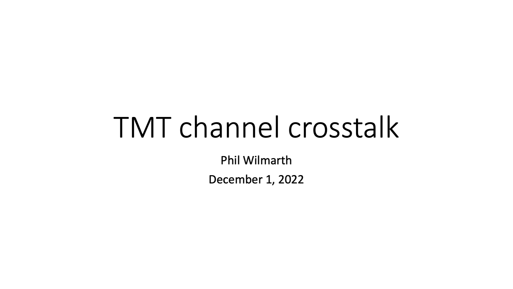
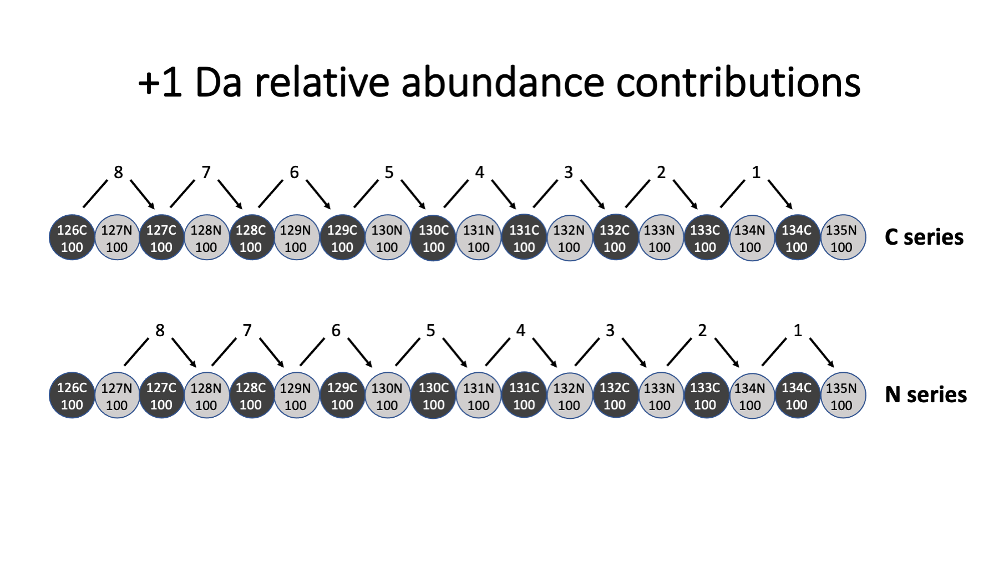
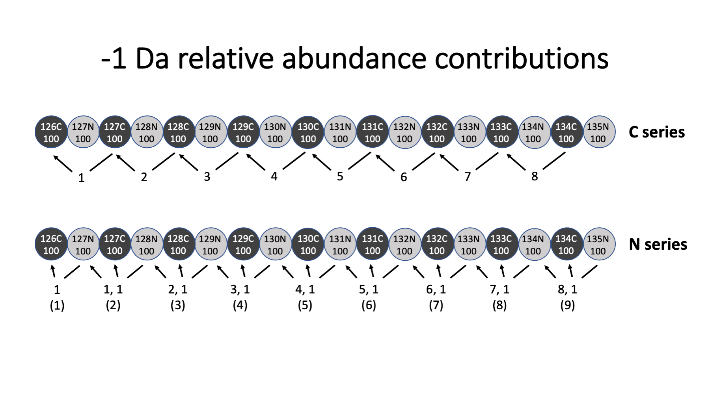
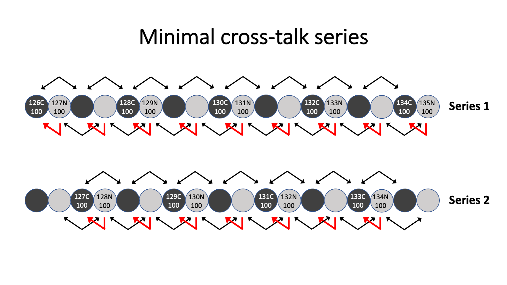
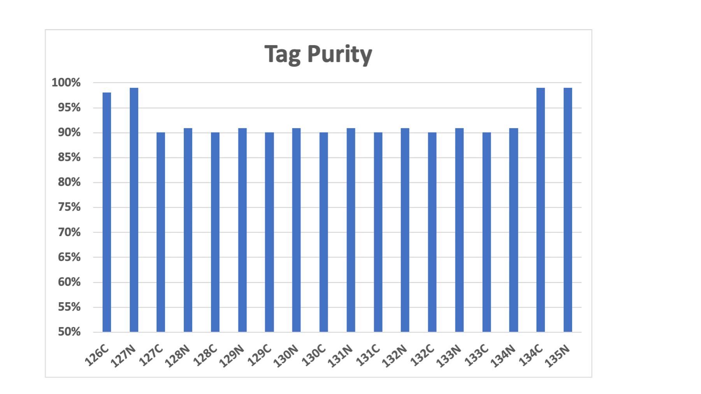
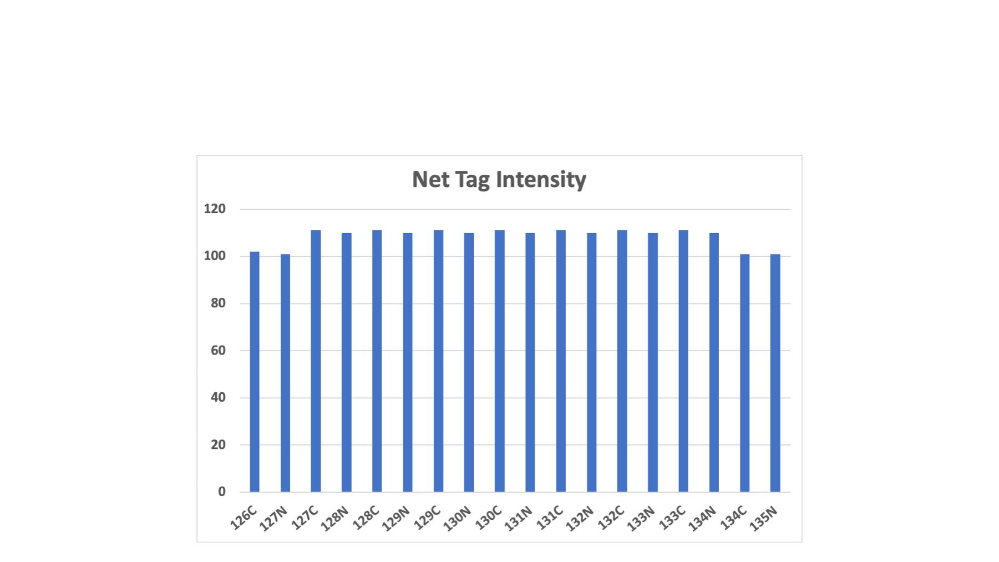
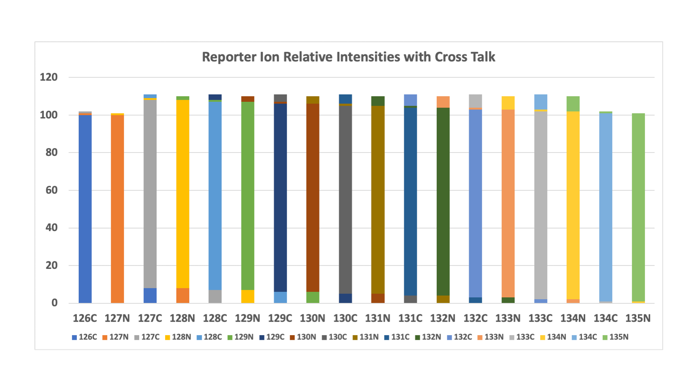

# TMT_channel_cross_talk

---

A [back-of-the-envelope calculation](https://en.wikipedia.org/wiki/Back-of-the-envelope_calculation) of TMT channel crosstalk for 18-plex reagents.

---

Carbon-13 has a natural abundance of about 1% in nature. TMT tags have 8 carbon atoms. The 126C tag, with all carbons being natural carbon (a mix is 99% C-12 and 1% C-13) would have about 8% of its total intensity in the 127C tag peak and 92% of the intensity in the 126C peak. Each nominal one mass unit heavier tag has a naturally occurring atom replaced by an isotopically enriched heavier isotope. We have progressively fewer natural atoms and the percentage of the intensity that falls into the next heavier tag (in its respective series - N or C) decreases as we go from light tags to heavier tags, as shown in the top row for the C-series tags.

We will assuming we have high resolution in the reporter ion region and can resolve the N- and C-series peaks. There is a similar natural C-13 effect in the carbon atoms in the N-series tags but it is shifted, as shown in the bottom row. The 127N tag has 8 natural carbon atoms.

Note: these numbers are approximate. No attempt was made to model the isotopic distributions of each tag. We would have to assume a purity for the C-13 and N-15 atoms to do that. If you look at the spec sheets for the isotopic distributions of the tags that are measured for TMT reagent batches, you will see that these numbers are pretty close.  

---

The C-13 and N-15 isotopically enriched atoms used to substitute the natural carbon and nitrogen atoms are probably 99% pure. That means that they have about 1% C-12 and N-14, respectively. This creates kind of an inverse isotopic distribution for the C-series tags where the heavies tags contribute more to the "N-1" tags than the light tags do. This is seen in the top row.

The situation for the N-series tags is more complicated. They have a mixture of C-13 atoms and one N-15 atom. Most of the "N-1" intensity crosstalk stays in the N-series (from the C-13 atoms). However, the delta-delta masses of the N- and C-series tags are 6 milliDa different. The N-15 atom crosstalks into the "N-1" C-series tag. There is a little scrambling between the N- and C-series, as shown in the bottom row.

---

The net effect of the "N+1" and "N-1" isotopic carryover is that each tag's peak is about 92% due to that channel and 8% that comes from adjacent channels, and this is (mostly) independent of tag. This carryover/crosstalk limits the dynamic range of TMT measurements. 5-fold changes are about as far as you can go before accuracy is affected. This is okay for most differential abundance measurements.

If you need more dynamic range for accuracy at larger fold-changes, you can create tag series that basically have every other channel empty. You can't get crosstalk from something that is not there. There is a series with 10 tags (top row) and the complement series with 8 tags (bottom row).

---

We can compute how much of each tag's peak area comes from that actual tag. We see that all of the middle tags are similar and have more crosstalk issues than the tags at either end of the tag masses. There is nothing lighter than 126C and 127 that can add to their intensities, so the crosstalk is only from heavier tags. Conversely, there are no heavier tags than 134C and 135N and the crosstalk only comes from lighter tags.

---

If we mixed samples in amounts such that the monoisotopic peak of each tag was 100%, we would see these total intensities for each tag.

---

We can combine the purity and total relative intensity information into this stacked bar plot where each tag has a different color. We see that the purity of the two lightest tags and the two heaviest tags are higher than the middle tags. Because less crosstalk contributes to the total intensity for the two lightest and two heaviest tags, they have reduced relative intensity totals.

I do not try to deconvolute tag intensities based on the measured tag isotopic distributions (the numbers in the spec sheets). That is more complicated than early algorithms were designed to handle because of the N-series tags. I just assume (and live with) the fact that large fold changes may be less accurate. It is safer to understand measurement limits (provided they are still usable) than to make corrections that may be error prone (noisy values, missing values).

---

Phil Wilmarth   December 1, 2022
